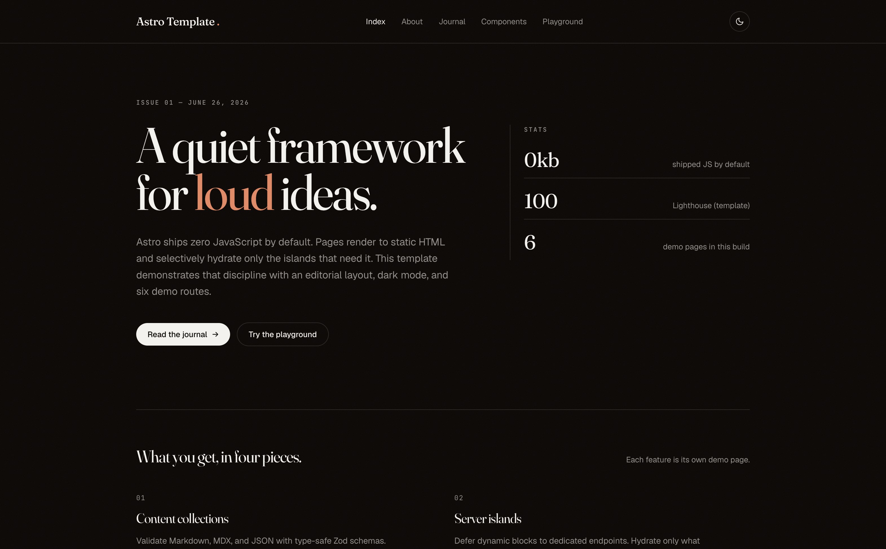
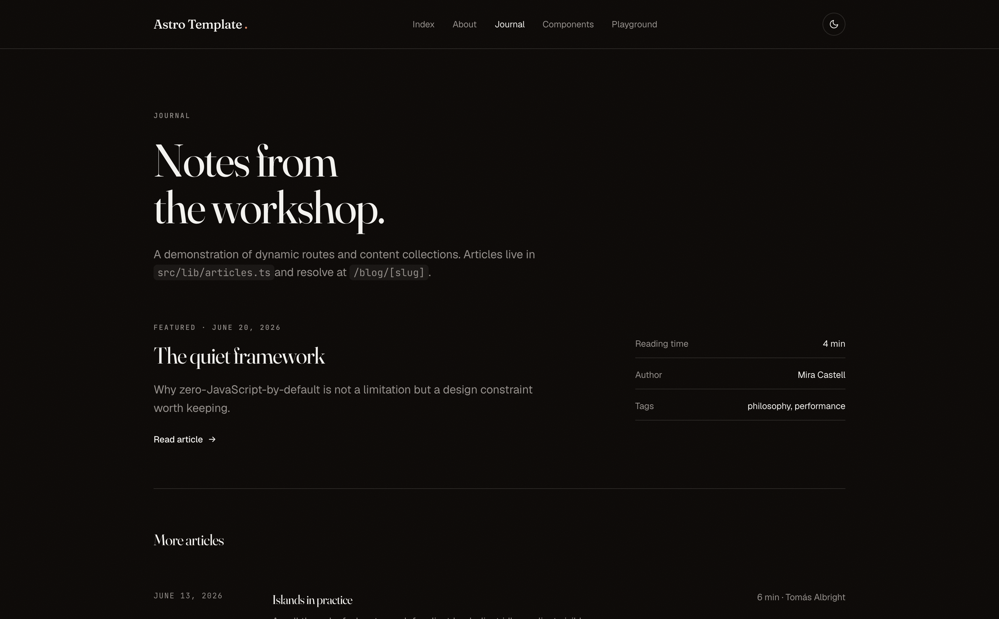
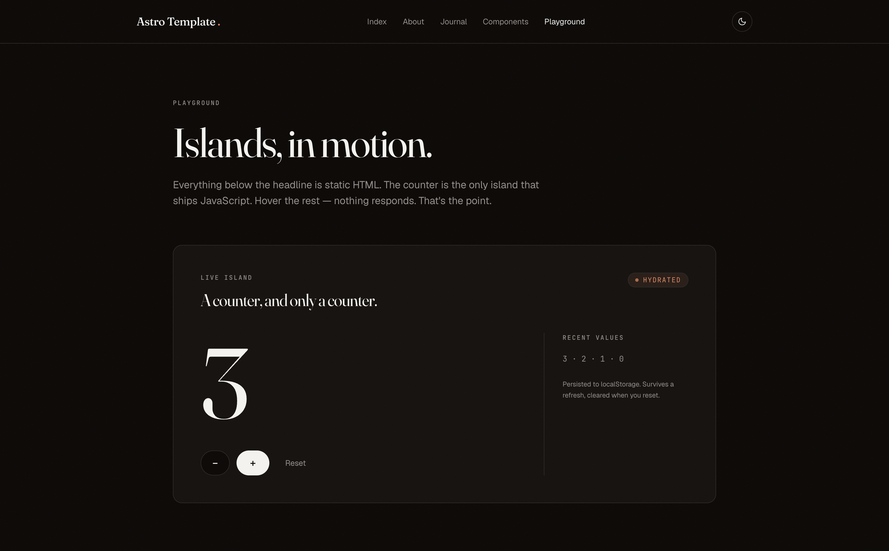

# Astro Dyad Template

An [Astro](https://astro.build) editorial-grade starter tailored for [Dyad](https://www.dyad.sh). Built with Astro 7, Tailwind v4, and a type-safe content collection. Ships with a home page, journal (blog), playground, components showcase, and a 404 — all wired to a shared `Layout` with header, footer, mobile menu, and dark-mode toggle.



## Preview

| Home                                | Journal                                | Playground                                      |
| ----------------------------------- | -------------------------------------- | ----------------------------------------------- |
|  |  |  |

## Stack

- **Astro 7** — file-based routing, view transitions, server islands
- **Tailwind CSS v4** — `@theme` design tokens, Vite plugin (no PostCSS config)
- **TypeScript 6** — strict mode
- **pnpm** — package manager

## Getting Started

```bash
pnpm install
pnpm dev
```

Open [http://localhost:4321](http://localhost:4321) to see the site.

Other scripts:

```bash
pnpm build      # production build to ./dist
pnpm preview    # preview the production build locally
```

## Project Structure

```
src/
├── components/
│   ├── Header.astro        # Top nav with theme + mobile-menu triggers
│   ├── Footer.astro        # Site footer
│   ├── MobileMenu.astro    # Slide-in nav for small screens
│   ├── ThemeToggle.astro   # Light / dark toggle
│   ├── counter.ts          # Tiny client-side counter island
│   ├── mobile-menu.ts      # Mobile menu controller
│   └── theme-toggle.ts     # Theme persistence (localStorage + system)
├── layouts/
│   └── Layout.astro        # Shared shell — <html>, meta, header, footer
├── lib/
│   ├── articles.ts         # Content collection helpers (sort, filter)
│   └── utils.ts            # `formatDate` and shared utilities
├── pages/
│   ├── index.astro         # Home
│   ├── about.astro         # About
│   ├── blog.astro          # Journal index
│   ├── blog/
│   │   └── [slug].astro    # Dynamic article route
│   ├── components.astro    # Component showcase
│   ├── playground.astro    # Interactive playground
│   └── 404.astro           # Not-found page
├── content/                # Content collections (Markdown / MDX)
└── styles/
    └── global.css          # Tailwind v4 entry + @theme tokens
public/                     # Static assets
astro.config.mjs            # Astro + Tailwind Vite plugin
tsconfig.json               # TS strict, Astro paths
```

## Features

- **Dark mode** — persisted via `localStorage`, respects `prefers-color-scheme` on first visit, no FOUC.
- **Mobile menu** — slide-in drawer with focus trap and `Escape` to close.
- **Type-safe content** — Astro content collections validate frontmatter with Zod.
- **View transitions** — enabled in `Layout.astro` for SPA-feel navigation.
- **Component showcase** — `/components` renders every primitive in isolation.
- **Playground** — `/playground` for tweaking tokens and ad-hoc UI experiments.

## Learn More

- [Astro Documentation](https://astro.build/docs) — features and API.
- [Astro Content Collections](https://astro.build/docs/guides/content-collections) — type-safe content.
- [Astro View Transitions](https://astro.build/docs/guides/view-transitions) — cross-page animations.
- [Tailwind CSS v4](https://tailwindcss.com/docs) — `@theme` design tokens.

## Deploy

Astro builds to static HTML — drop `dist/` on any host or use an adapter:

- [Deploy to Vercel](https://docs.astro.build/en/guides/deploy/vercel/)
- [Deploy to Netlify](https://docs.astro.build/en/guides/deploy/netlify/)
- [Deploy to Cloudflare Pages](https://docs.astro.build/en/guides/deploy/cloudflare/)
- [Deploy to GitHub Pages](https://docs.astro.build/en/guides/deploy/github/)
